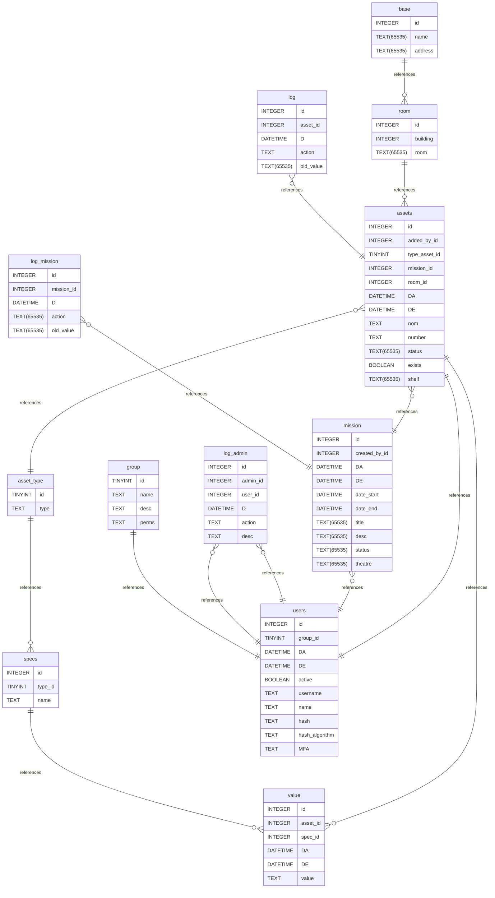

# Untitled Diagram documentation
## Summary

- [Introduction](#introduction)
- [Database Type](#database-type)
- [Table Structure](#table-structure)
	- [assets](#assets)
	- [asset_type](#asset_type)
	- [specs](#specs)
	- [value](#value)
	- [users](#users)
	- [group](#group)
	- [log_admin](#log_admin)
	- [log](#log)
	- [mission](#mission)
	- [log_mission](#log_mission)
	- [room](#room)
	- [base](#base)
- [Relationships](#relationships)
- [Database Diagram](#database-diagram)

## Introduction

## Database type

- **Database system:** MySQL
## Table structure

### assets
in mission, on repair, available...
| Name        | Type          | Settings                      | References                    | Note                           |
|-------------|---------------|-------------------------------|-------------------------------|--------------------------------|
| **id** | INTEGER | 🔑 PK, not null, unique, autoincrement |  |vehicle no 45, 12th HK 416... |
| **added_by_id** | INTEGER | not null |  | |
| **type_asset_id** | TINYINT | not null | asset's type | |
| **mission_id** | INTEGER | null | asset in a mission |no assigned mission if value not assigned |
| **room_id** | INTEGER | null |  | |
| **DA** | DATETIME | not null |  | |
| **DE** | DATETIME | not null |  | |
| **nom** | TEXT | not null |  |SN, PN, chassi no... |
| **number** | TEXT | null |  |MRE number 3574
may not be necessary |
| **status** | TEXT(65535) | not null |  | |
| **exists** | BOOLEAN | not null, default: TRUE |  |discarded, destroyed, sold, or in stock |
| **shelf** | TEXT(65535) | null |  |shelf no 355 | 

### asset_type

| Name        | Type          | Settings                      | References                    | Note                           |
|-------------|---------------|-------------------------------|-------------------------------|--------------------------------|
| **id** | TINYINT | 🔑 PK, not null, unique, autoincrement | specs of a type |vehicle, MRE, weapon... |
| **type** | TEXT | not null |  |vehicle, MRE, weapon... | 

### specs

| Name        | Type          | Settings                      | References                    | Note                           |
|-------------|---------------|-------------------------------|-------------------------------|--------------------------------|
| **id** | INTEGER | 🔑 PK, not null, unique, autoincrement | value of a spec |specs #7 = how much km a car has |
| **type_id** | TINYINT | not null |  | |
| **name** | TEXT | not null |  |km, expiration date, bullet... | 

### value

| Name        | Type          | Settings                      | References                    | Note                           |
|-------------|---------------|-------------------------------|-------------------------------|--------------------------------|
| **id** | INTEGER | 🔑 PK, not null, unique, autoincrement |  |link between spec and asset by adding value : 3rd car''s kilometers : 400000km |
| **asset_id** | INTEGER | not null | value of a specification of an asset | |
| **spec_id** | INTEGER | not null |  | |
| **DA** | DATETIME | not null |  | |
| **DE** | DATETIME | not null |  | |
| **value** | TEXT | not null |  |25000Km, m855 ball point... | 

### users

| Name        | Type          | Settings                      | References                    | Note                           |
|-------------|---------------|-------------------------------|-------------------------------|--------------------------------|
| **id** | INTEGER | 🔑 PK, not null, unique, autoincrement | added by user | |
| **group_id** | TINYINT | not null |  | |
| **DA** | DATETIME | not null |  | |
| **DE** | DATETIME | not null |  | |
| **active** | BOOLEAN | not null, default: TRUE |  | |
| **username** | TEXT | not null, unique |  | |
| **name** | TEXT | null |  | |
| **hash** | TEXT | not null |  |1945B09A02C889190B3 |
| **hash_algorithm** | TEXT | not null |  |algo_rounds
ARGON2_32 |
| **MFA** | TEXT | null |  |seed of MFA | 

### group
admin, user, viewer, technician
| Name        | Type          | Settings                      | References                    | Note                           |
|-------------|---------------|-------------------------------|-------------------------------|--------------------------------|
| **id** | TINYINT | 🔑 PK, not null, unique, autoincrement | user groups | |
| **name** | TEXT | not null |  |admin, user |
| **desc** | TEXT | null |  | |
| **perms** | TEXT | not null |  | | 

### log_admin
separated admin logs for added security, when user (user_id) are edited/added... or when app settings are changed
| Name        | Type          | Settings                      | References                    | Note                           |
|-------------|---------------|-------------------------------|-------------------------------|--------------------------------|
| **id** | INTEGER | 🔑 PK, not null, unique, autoincrement | target user | |
| **admin_id** | INTEGER | not null | admin | |
| **user_id** | INTEGER | null |  | |
| **D** | DATETIME | not null |  | |
| **action** | TEXT | not null |  |renamed john to martha |
| **desc** | TEXT | null |  | | 

### log

| Name        | Type          | Settings                      | References                    | Note                           |
|-------------|---------------|-------------------------------|-------------------------------|--------------------------------|
| **id** | INTEGER | 🔑 PK, not null, unique, autoincrement |  | |
| **asset_id** | INTEGER | not null | asset's log | |
| **D** | DATETIME | not null |  | |
| **action** | TEXT | not null |  |added car #3
changed bullet 7''s grammage value |
| **old_value** | TEXT(65535) | not null |  | | 

### mission

| Name        | Type          | Settings                      | References                    | Note                           |
|-------------|---------------|-------------------------------|-------------------------------|--------------------------------|
| **id** | INTEGER | 🔑 PK, not null, unique, autoincrement |  | |
| **created_by_id** | INTEGER | not null | mission created by | |
| **DA** | DATETIME | not null |  | |
| **DE** | DATETIME | not null |  | |
| **date_start** | DATETIME | null |  | |
| **date_end** | DATETIME | null |  | |
| **title** | TEXT(65535) | not null |  | |
| **desc** | TEXT(65535) | null |  | |
| **status** | TEXT(65535) | not null |  |finished, planned... |
| **theatre** | TEXT(65535) | not null |  |location | 

### log_mission

| Name        | Type          | Settings                      | References                    | Note                           |
|-------------|---------------|-------------------------------|-------------------------------|--------------------------------|
| **id** | INTEGER | 🔑 PK, not null, unique, autoincrement |  | |
| **mission_id** | INTEGER | not null | mission logs | |
| **D** | DATETIME | not null |  | |
| **action** | TEXT(65535) | not null |  |changed date, removed description of mission... |
| **old_value** | TEXT(65535) | not null |  | | 

### room

| Name        | Type          | Settings                      | References                    | Note                           |
|-------------|---------------|-------------------------------|-------------------------------|--------------------------------|
| **id** | INTEGER | 🔑 PK, not null, unique, autoincrement | asset in room | |
| **building** | INTEGER | not null |  | |
| **room** | TEXT(65535) | not null |  |Paris | 

### base

| Name        | Type          | Settings                      | References                    | Note                           |
|-------------|---------------|-------------------------------|-------------------------------|--------------------------------|
| **id** | INTEGER | 🔑 PK, not null, unique, autoincrement | room in base | |
| **name** | TEXT(65535) | not null |  | |
| **address** | TEXT(65535) | not null |  | | 

## Relationships

- **assets to asset_type**: many_to_one
- **value to assets**: many_to_one
- **specs to value**: one_to_many
- **asset_type to specs**: one_to_many
- **users to assets**: one_to_one
- **group to users**: one_to_one
- **log_admin to users**: many_to_one
- **log_admin to users**: many_to_one
- **log to assets**: many_to_one
- **log_mission to mission**: many_to_one
- **assets to mission**: many_to_one
- **mission to users**: many_to_one
- **room to assets**: one_to_many
- **base to room**: one_to_many

## Database Diagram

