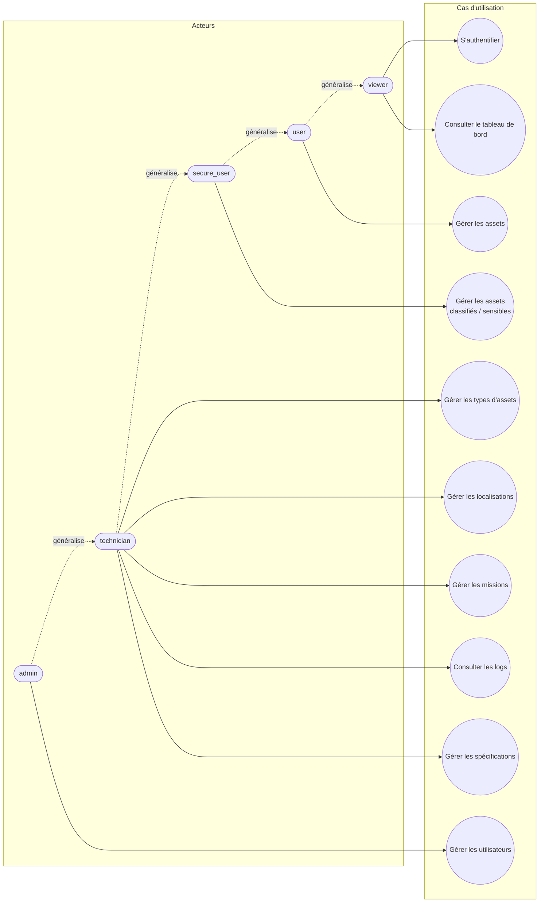
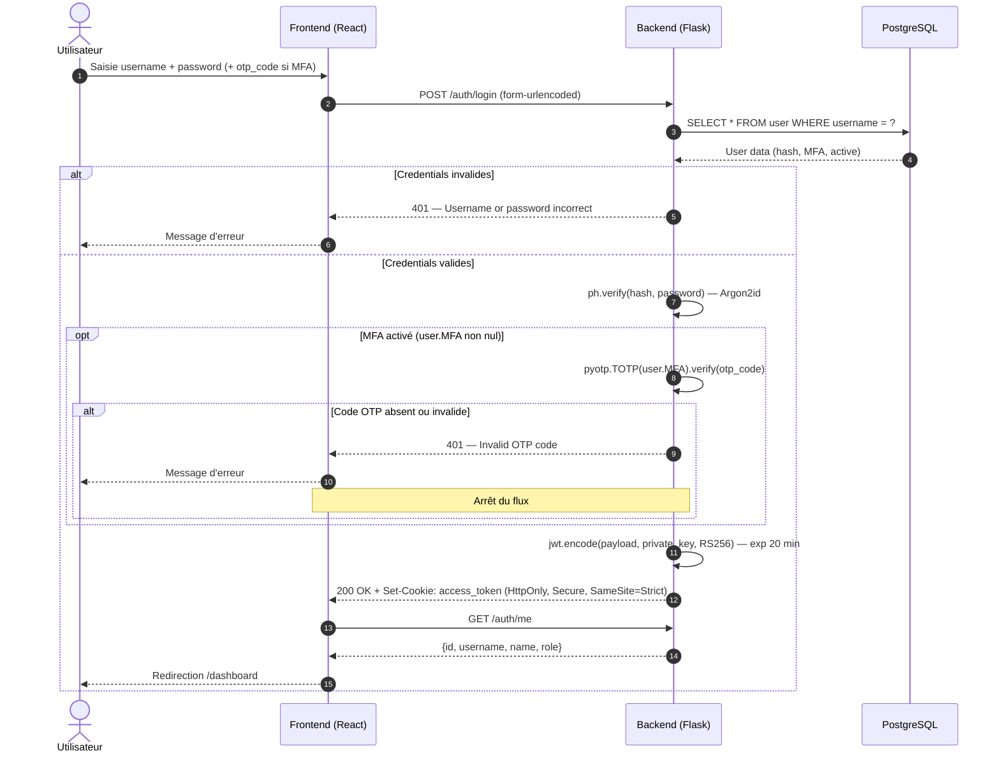
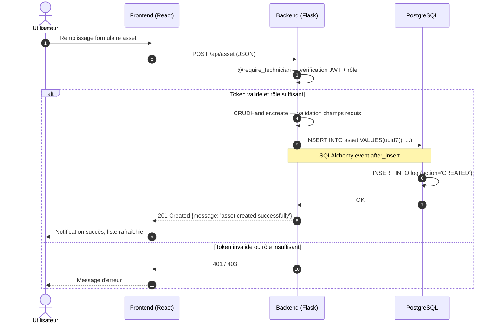
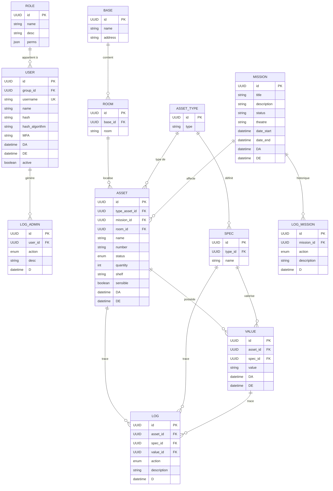
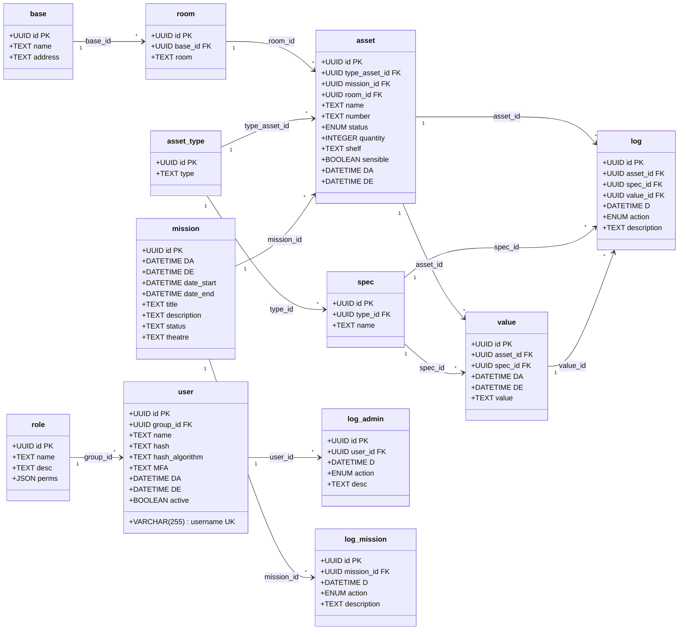
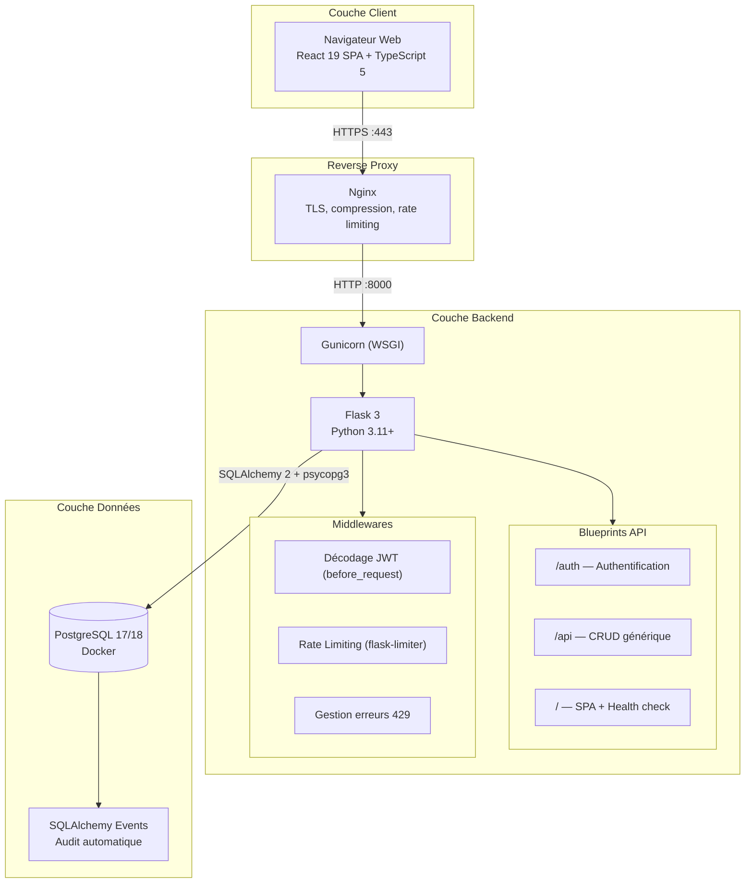
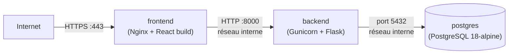
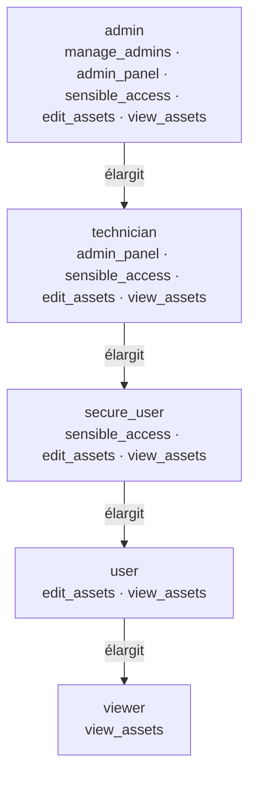
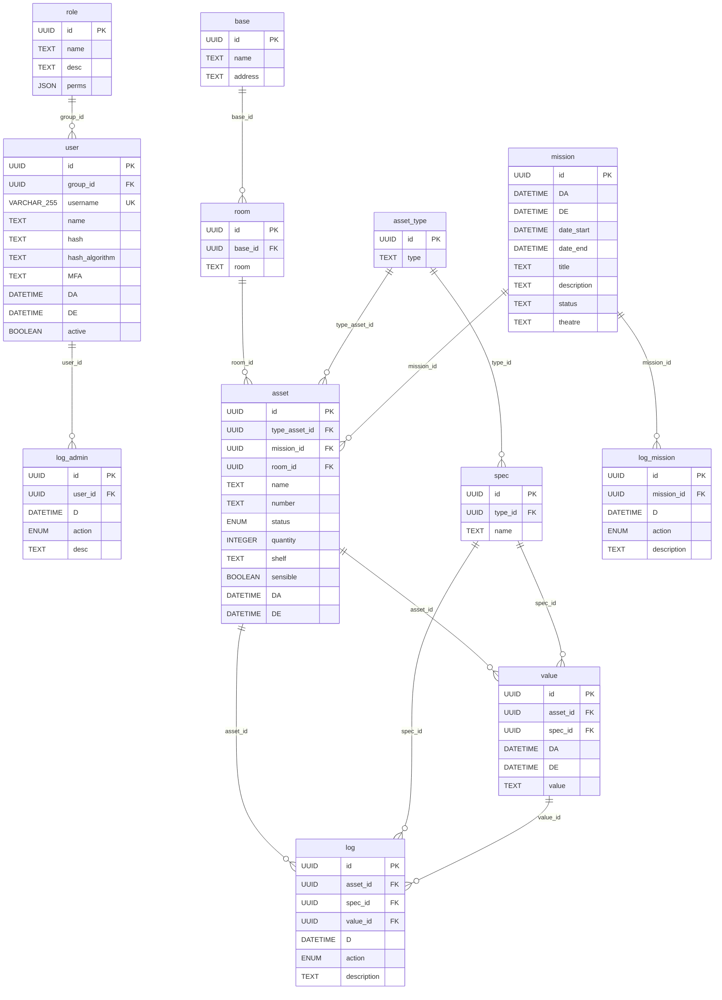
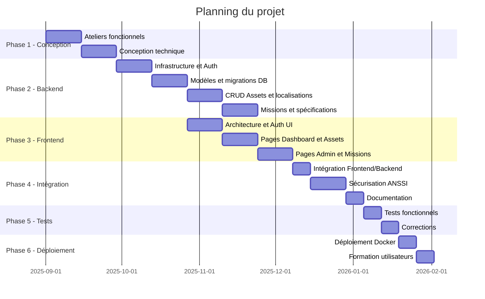

# RAPPORT DE PROJET
## Système de Gestion Logistique Militaire (SGLM)

---

**Session BTS ESNA 2024-2026**

**Épreuve E5 – Projet de conception et de développement**

---

| | |
|---|---|
| **Projet** | Système de Gestion Logistique Militaire |
| **Candidat(s)** | [Nom du/des candidat(s)] |
| **Session** | 2024-2026 |
| **Date** | Janvier 2026 |

---

## SOMMAIRE

1. [Présentation du projet](#1-présentation-du-projet)
2. [Analyse du besoin](#2-analyse-du-besoin)
3. [Conception de la base de données](#3-conception-de-la-base-de-données)
4. [Architecture technique](#4-architecture-technique)
5. [Développement de l'application](#5-développement-de-lapplication)
6. [Sécurité et conformité](#6-sécurité-et-conformité)
7. [Tests et validation](#7-tests-et-validation)
8. [Conclusion et perspectives](#8-conclusion-et-perspectives)
9. [Annexes](#9-annexes)

---

---

## 1. PRÉSENTATION DU PROJET

### 1.1 Contexte

La base militaire gère actuellement ses stocks et sa flotte de véhicules de façon partiellement manuelle, entraînant :
- Des erreurs de suivi et pertes de traçabilité
- Des ruptures de stock critiques
- Une visibilité limitée sur les ressources déployées
- Un temps de réponse opérationnelle rallongé
- Une non-conformité avec les standards de sécurité ANSSI

### 1.2 Objectifs du projet

Le projet SGLM vise à développer une application web complète permettant :

1. **Centraliser la gestion des stocks** (armement, munitions, rations, équipements de protection, véhicules) dans un système unique et sécurisé
2. **Assurer un suivi en temps réel** des assets et des missions avec journalisation automatique de toutes les opérations
3. **Implémenter une gestion fine des droits d'accès** basée sur les rôles (RBAC) conforme aux normes militaires
4. **Proposer une interface web moderne** permettant la gestion des assets, missions, localisations et utilisateurs
5. **Garantir la disponibilité et la sécurité** du système par une architecture conteneurisée et des pratiques de sécurité conformes à l'ANSSI

### 1.3 Périmètre opérationnel

| Critère | Spécification |
|---------|---------------|
| Utilisateurs cibles | 50-200 utilisateurs simultanés |
| Volume de données | ~100 000 enregistrements matériels |
| Déploiement | Infrastructure Docker conteneurisée (PostgreSQL + Gunicorn + Nginx) |
| Accès | Interface web via navigateur, HTTPS obligatoire en production |

### 1.4 Acteurs du système

| Rôle | Description | Permissions principales |
|------|-------------|------------------------|
| **admin** | Administrateur système | Gestion complète (utilisateurs, configuration, audit complet) |
| **technician** | Technicien logistique | CRUD assets, bases, salles, types, spécifications, missions |
| **secure_user** | Utilisateur militaire habilité | Accès en lecture/écriture aux matériels sensibles |
| **user** | Utilisateur militaire standard | Lecture/écriture sur les assets non sensibles |
| **viewer** | Observateur (affichage) | Consultation seule, rôle attribué par défaut à l'inscription |

---

## 2. ANALYSE DU BESOIN

### 2.1 Diagramme des cas d'utilisation



### 2.2 Cas d'utilisation détaillés

#### UC-01 : Authentification utilisateur

| Élément | Description |
|---------|-------------|
| **Acteur principal** | Utilisateur (tous rôles) |
| **Préconditions** | L'utilisateur dispose d'un compte actif |
| **Postconditions** | L'utilisateur est authentifié et accède au tableau de bord |

**Scénario nominal :**
1. L'utilisateur accède à la page de connexion (`/login`)
2. Le système affiche le formulaire d'authentification
3. L'utilisateur saisit son identifiant et son mot de passe
4. Le frontend soumet la requête `POST /auth/login` en `application/x-www-form-urlencoded`
5. Le backend valide les credentials via `argon2id`
6. Si le compte a le MFA activé (`user.MFA` non nul), le backend exige un champ `otp_code` TOTP valide
7. Le backend génère un token JWT RS256 (durée : 20 minutes)
8. Le token est transmis dans un cookie `HttpOnly; Secure; SameSite=Strict`
9. Le frontend appelle `GET /auth/me` pour récupérer le profil utilisateur
10. Le système redirige vers `/dashboard`

**Scénarios alternatifs :**
- Credentials invalides : retour `401 Unauthorized`, message « Username or password incorrect »
- Compte inactif : retour `401 Unauthorized`
- MFA activé, code absent : retour `401`, message « OTP code required »
- MFA activé, code invalide ou expiré : retour `401`, message « Invalid OTP code »
- 5 tentatives en 1 minute : retour `429 Too Many Requests` (rate limiting `flask-limiter`)

#### UC-02 : Créer un asset

| Élément | Description |
|---------|-------------|
| **Acteur principal** | Utilisateur (rôle `technician` ou supérieur) |
| **Préconditions** | L'utilisateur est authentifié avec droits d'écriture |
| **Postconditions** | L'asset est enregistré en base de données avec traçabilité |

**Scénario nominal :**
1. L'utilisateur accède au module Assets (`/assets`)
2. L'utilisateur clique sur « Ajouter un asset »
3. Le système affiche une modale de création
4. L'utilisateur renseigne : type, nom, statut, localisation, quantité
5. Le frontend soumet `POST /api/asset` avec les données JSON
6. Le backend valide le JWT via le décorateur `@require_technician`
7. Le `CRUDHandler` vérifie les champs requis (`type_asset_id`, `name`, `status`)
8. L'asset est inséré en base avec horodatage UTC (`DA`, `DE`)
9. Le listener SQLAlchemy `after_insert` crée automatiquement une entrée dans la table `log`
10. Le système retourne `201 Created` et l'interface se rafraîchit

### 2.3 Diagramme de séquence - Authentification



### 2.4 Diagramme de séquence - Création d'un asset



---

## 3. CONCEPTION DE LA BASE DE DONNÉES

### 3.1 Choix du SGBD

Le projet utilise **PostgreSQL 17** (développement) et **PostgreSQL 18-alpine** (production), piloté via **SQLAlchemy 2.x** avec le connecteur **psycopg3**. Ce choix remplace MySQL mentionné dans les premières versions du cahier des charges : PostgreSQL offre un meilleur support des types JSON natifs (utilisés pour les permissions des rôles), des UUID nativement, et une meilleure conformité SQL.

Les identifiants primaires utilisent **UUID v7** (`uuid7`), qui combine un préfixe temporel avec une composante aléatoire, garantissant l'unicité distribuée tout en restant triables chronologiquement.

### 3.2 Modèle Conceptuel de Données (MCD)



### 3.3 Modèle Logique de Données (MLD)



### 3.4 Dictionnaire de données

#### Table `user`

| Attribut | Type | Contraintes | Description |
|----------|------|-------------|-------------|
| id | UUID | PK, NOT NULL | Identifiant unique UUID v7 |
| group_id | UUID | FK→role, NOT NULL | Rôle de l'utilisateur |
| username | VARCHAR(255) | UNIQUE, NOT NULL | Identifiant de connexion |
| name | TEXT | NULL | Nom complet de l'utilisateur |
| hash | TEXT | NOT NULL | Empreinte du mot de passe (Argon2id) |
| hash_algorithm | TEXT | NOT NULL | Algorithme utilisé : `argon2` |
| MFA | TEXT | NULL | Graine TOTP pour l'authentification à deux facteurs (champ réservé) |
| DA | DATETIME | NOT NULL | Date de création (UTC) |
| DE | DATETIME | NOT NULL | Date de dernière modification (UTC) |
| active | BOOLEAN | NOT NULL, DEFAULT TRUE | Compte actif ou désactivé |

#### Table `asset`

| Attribut | Type | Contraintes | Description |
|----------|------|-------------|-------------|
| id | UUID | PK, NOT NULL | Identifiant unique UUID v7 |
| type_asset_id | UUID | FK→asset_type, NOT NULL | Type d'asset |
| mission_id | UUID | FK→mission, NULL | Mission assignée (optionnel) |
| room_id | UUID | FK→room, NULL | Localisation (optionnel) |
| name | TEXT | NOT NULL | Désignation ou numéro de série |
| number | TEXT | NULL | Numéro secondaire (ex. numéro de lot) |
| status | ENUM | NOT NULL | `STOCK`, `DESTROYED`, `SOLD`, `LOST`, `TRANSIT`, `PURCHASED` |
| quantity | INTEGER | NULL | Quantité pour les lots |
| shelf | TEXT | NULL | Emplacement physique (rayon, étagère) |
| sensible | BOOLEAN | NULL | Matériel soumis à restriction d'accès |
| DA | DATETIME | NOT NULL | Date de création (UTC) |
| DE | DATETIME | NOT NULL | Date de dernière modification (UTC) |

#### Table `role`

| Attribut | Type | Contraintes | Description |
|----------|------|-------------|-------------|
| id | UUID | PK, NOT NULL | Identifiant unique UUID v7 |
| name | TEXT | NOT NULL | Identifiant du rôle (`admin`, `technician`, `secure_user`, `user`, `viewer`) |
| desc | TEXT | NULL | Description du rôle |
| perms | JSON | NOT NULL | Objet JSON des permissions détaillées (`manage_admins`, `admin_panel`, `sensible_access`, `edit_assets`, `view_assets`) |

### 3.5 Audit automatique par listeners SQLAlchemy

L'audit des données est implémenté via les **event listeners SQLAlchemy** (fichier `events.py`), qui s'exécutent côté applicatif à chaque opération sur les modèles concernés. Cette approche a été préférée aux triggers SQL natifs pour une meilleure portabilité entre SGBD.

#### Listener `after_insert` sur `Asset`

```python
@event.listens_for(Asset, 'after_insert')
def _asset_after_insert(mapper, connection, target):
    connection.execute(Log.__table__.insert().values(
        id=uuid7(),
        asset_id=target.id,
        D=datetime.utcnow(),
        action='CREATED',
        description=f'Asset created: {target.name} '
                    f'(Type: {target.type_asset_id}, Status: {target.status})',
    ))
```

#### Listener `after_update` sur `Asset`

Détecte les modifications de champs (`name`, `status`, `mission_id`, `room_id`, `quantity`, `shelf`, `sensible`) et enregistre les transitions `ancienne_valeur -> nouvelle_valeur` dans la table `log`.

#### Listener `after_delete` sur `Asset`

Enregistre la suppression avec la dernière valeur connue de l'asset.

Des listeners équivalents existent pour les modèles `Value`, `Mission` et `User` (tables `log`, `log_mission`, `log_admin`).

---

## 4. ARCHITECTURE TECHNIQUE

### 4.1 Diagramme d'architecture globale



### 4.2 Stack technique

| Composant | Technologie | Version | Justification |
|-----------|-------------|---------|---------------|
| **Frontend** | React + TypeScript | 19 / 5.9 | SPA moderne, typage strict |
| **Routage frontend** | React Router | 7 | Navigation SPA |
| **Build frontend** | Vite | 8 | Build rapide, Hot Module Replacement |
| **Backend** | Flask (Python) | 3.1 | API REST légère et flexible |
| **Serveur WSGI** | Gunicorn | 23 | Serveur de production robuste |
| **ORM** | SQLAlchemy | 2.x | Mapping objet-relationnel, migrations |
| **Migrations** | Flask-Migrate (Alembic) | 4 | Gestion évolutions schéma |
| **Base de données** | PostgreSQL | 17 (dev) / 18 (prod) | SGBD robuste, JSON natif, UUID |
| **Connecteur DB** | psycopg3 | 3.2 | Driver PostgreSQL moderne |
| **Authentification** | JWT RS256 (PyJWT) | 2.10 | Tokens signés asymétriquement |
| **Hachage MDP** | Argon2id (argon2-cffi) | 25.1 | Recommandé ANSSI/OWASP |
| **Rate limiting** | flask-limiter | 3.7 | Protection brute force |
| **Logs** | Loguru | 0.7 | Logs structurés avec rotation |
| **Reverse proxy** | Nginx | dernière LTS | TLS, compression, cache statique |
| **Conteneurisation** | Docker + Compose | — | Portabilité et isolation |
| **Gestionnaire de paquets** | pnpm + uv (turbo) | — | Monorepo, installs rapides |

### 4.3 Structure réelle du projet

```
P5-stock/                          ← Monorepo (pnpm workspaces + turbo)
├── backend/
│   ├── pyproject.toml             ← Dépendances Python (uv)
│   ├── private.pem / public.pem   ← Paire de clés RSA pour JWT
│   ├── src/
│   │   ├── __init__.py            ← Factory create_app(), instance Gunicorn
│   │   ├── middleware.py          ← Injection JWT dans request.current_user
│   │   ├── database/
│   │   │   ├── config.py          ← Config SQLAlchemy
│   │   │   ├── model.py           ← Modèles SQLAlchemy (Role, User, Asset…)
│   │   │   ├── events.py          ← Listeners d'audit automatique
│   │   │   └── init_db.py         ← Données de seed (rôles, comptes par défaut)
│   │   ├── routes/
│   │   │   ├── root.py            ← Health check, redirections
│   │   │   ├── auth.py            ← /auth/login, /auth/register, /auth/me, /auth/logout
│   │   │   └── API/
│   │   │       └── CRUD.py        ← Blueprint /api — tous les endpoints CRUD
│   │   └── services/
│   │       ├── config.py          ← Instance flask-limiter
│   │       ├── decorators.py      ← @require_viewer, @require_user… @require_admin
│   │       ├── tools.py           ← jwt_decode(), validate_username(), verify_password()
│   │       ├── CRUD_tools.py      ← Fonctions create/read/update/delete + gestion erreurs
│   │       └── logs.py            ← Configuration Loguru
│   └── logs/                      ← Fichiers de logs applicatifs
├── frontend/
│   ├── package.json
│   ├── vite.config.ts             ← Proxy /api et /auth → backend en dev
│   ├── src/
│   │   ├── main.tsx               ← Point d'entrée React
│   │   ├── App.tsx                ← Routeur et ProtectedRoute
│   │   ├── context/
│   │   │   └── AuthContext.tsx    ← Gestion état utilisateur + login/logout
│   │   ├── layouts/
│   │   │   └── AppLayout.tsx      ← Barre de navigation + liens
│   │   ├── pages/
│   │   │   ├── LoginPage.tsx
│   │   │   ├── DashboardPage.tsx
│   │   │   ├── AssetsPage.tsx
│   │   │   ├── MissionsPage.tsx
│   │   │   ├── AdminPage.tsx
│   │   │   └── PlaceholderPage.tsx
│   │   ├── api/
│   │   │   ├── client.ts          ← apiFetch() + authFetch() + ApiError
│   │   │   ├── assets.ts
│   │   │   ├── missions.ts
│   │   │   ├── admin.ts
│   │   │   └── dashboard.ts
│   │   └── types/
│   │       ├── index.ts           ← Interfaces TypeScript (Asset, User, Mission…)
│   │       └── assets.ts          ← Constantes statuts et badges
├── docker/
│   ├── dev/
│   │   └── docker-compose.yml     ← PostgreSQL dev uniquement
│   └── server/
│       ├── docker-compose.yml     ← Stack complète production
│       ├── Dockerfile.backend     ← Image Flask + Gunicorn
│       ├── Dockerfile.frontend    ← Build Vite + Nginx
│       └── nginx.conf             ← Reverse proxy + TLS + rate limiting
├── documentation/
│   └── database/
│       ├── DB v1.5.json
│       └── DB v1.5.sql
└── turbo.json                     ← Pipeline de build monorepo
```

### 4.4 Architecture de déploiement Docker

En production, trois conteneurs Docker communiquent sur un réseau interne :



| Conteneur | Image | Rôle |
|-----------|-------|------|
| `p5_postgres` | `postgres:18-alpine` | Base de données persistante avec volume dédié |
| `p5_backend` | Build custom (Python 3.11) | API Flask servie par Gunicorn sur le port 8000 |
| `p5_frontend` | Build custom (Nginx + Vite build) | Sert les assets statiques React et fait office de reverse proxy vers le backend |

Les healthchecks Docker assurent le démarrage ordonné : PostgreSQL doit être prêt avant le backend, le backend doit répondre sur `/health` avant que le frontend ne soit exposé.

---

## 5. DÉVELOPPEMENT DE L'APPLICATION

### 5.1 API REST — Endpoints implémentés

#### Module Authentification (`/auth`)

| Méthode | Endpoint | Description | Autorisation |
|---------|----------|-------------|--------------|
| GET | `/auth/login` | Redirige vers `/login` frontend | Public |
| POST | `/auth/login` | Connexion (form-urlencoded) | Public, rate limité 5/min |
| POST | `/auth/register` | Inscription (JSON) | Public |
| GET | `/auth/me` | Profil de l'utilisateur courant | JWT valide |
| POST | `/auth/logout` | Suppression du cookie | JWT valide |

#### Module Assets (`/api`)

| Méthode | Endpoint | Description | Autorisation minimale |
|---------|----------|-------------|----------------------|
| GET | `/api/assets` | Liste enrichie des assets | viewer |
| GET | `/api/asset/<uuid>` | Détail d'un asset | technician |
| POST | `/api/asset` | Créer un asset | technician |
| PUT | `/api/asset/<uuid>` | Modifier un asset | technician |
| DELETE | `/api/asset/<uuid>` | Supprimer un asset | technician |
| GET | `/api/asset_types` | Liste des types d'assets | viewer |
| POST | `/api/asset_type` | Créer un type | technician |
| PUT/DELETE | `/api/asset_type/<uuid>` | Modifier/supprimer un type | technician |
| GET | `/api/bases` | Liste des bases | viewer |
| POST | `/api/base` | Créer une base | technician |
| PUT/DELETE | `/api/base/<uuid>` | Modifier/supprimer une base | technician |
| GET | `/api/rooms` | Liste des salles avec base | viewer |
| POST | `/api/room` | Créer une salle | technician |
| PUT/DELETE | `/api/room/<uuid>` | Modifier/supprimer une salle | technician |
| GET | `/api/missions` | Liste des missions avec nb assets | viewer |
| POST | `/api/mission` | Créer une mission | technician |
| PUT/DELETE | `/api/mission/<uuid>` | Modifier/supprimer une mission | technician |
| POST | `/api/spec` | Créer une spécification | technician |
| POST | `/api/value` | Créer une valeur pour un asset | technician |
| PUT/DELETE | `/api/value/<uuid>` | Modifier/supprimer une valeur | technician |
| GET | `/api/users` | Liste des utilisateurs | admin |
| GET | `/api/roles` | Liste des rôles | viewer |
| GET | `/api/logs` | 50 derniers logs triés desc | viewer |
| GET | `/health` | Health check Docker | Public |

### 5.2 Implémentation du CRUD générique

Le backend utilise un décorateur `CRUDHandler.crud_operation` qui factorise la logique des quatre opérations CRUD. Chaque route déclare uniquement ses métadonnées (modèle, champs requis, champs acceptables) et délègue l'exécution :

```python
@CRUD.post("/asset")
@require_technician
@CRUDHandler.crud_operation(
    Asset, "asset", "create",
    required_fields=["type_asset_id", "name", "status"],
    acceptable_fields=["mission_id", "room_id", "number",
                       "quantity", "shelf", "sensible"]
)
def insert_asset():
    pass
```

Le handler instancie le modèle, horodate `DA`/`DE`, filtre les champs acceptables (protection contre la pollution de paramètres), puis effectue le commit. Les erreurs (`400 champ manquant`, `404 ressource introuvable`, `500 erreur interne`) sont uniformisées et journalisées via Loguru.

### 5.3 Authentification et gestion de sessions

Le formulaire de connexion soumet les credentials en `application/x-www-form-urlencoded`. Le backend valide le mot de passe avec **Argon2id**, génère un **JWT RS256** valable 20 minutes et le dépose dans un cookie sécurisé :

```python
response.set_cookie(
    'access_token',
    access_token,
    httponly=True,      # Protection XSS
    secure=True,        # HTTPS uniquement
    samesite='Strict',  # Protection CSRF
    max_age=20 * 60,
    path='/'
)
```

Un hook `before_request` décode le cookie et injecte l'objet `User` SQLAlchemy dans `request.current_user`. Les routes protégées lisent ce contexte via les décorateurs `@require_*`.

Côté frontend, l'`AuthContext` React appelle `GET /auth/me` au démarrage pour restaurer la session sans stocker le token en mémoire locale.

### 5.4 Système d'autorisation par décorateurs



Les décorateurs implémentent une chaîne de responsabilité ascendante : chaque décorateur autorise son propre rôle et délègue au niveau supérieur si nécessaire. Ainsi, `@require_viewer` autorise tous les rôles, tandis que `@require_admin` n'autorise que l'administrateur.

### 5.5 Interface utilisateur

L'interface est construite en **React 19 + TypeScript 5.9**, avec un CSS personnalisé à thème militaire. La navigation est gérée par **React Router 7**.

#### Pages implémentées

| Page | Route | Description |
|------|-------|-------------|
| Connexion | `/login` | Formulaire username/password, messages d'erreur |
| Tableau de bord | `/dashboard` | Statistiques temps réel, journal d'activité |
| Assets | `/assets` | Tableau filtrable, modale création/édition, badges statuts |
| Missions | `/missions` | Liste des missions avec compteur d'assets |
| Administration | `/adminpanel` | Tableau utilisateurs, rôles (accès admin uniquement) |
| Utilisateurs | `/users` | Page prévue (placeholder) |
| Rapports | `/reports` | Page prévue (placeholder) |

---

## 6. SÉCURITÉ ET CONFORMITÉ

### 6.1 Conformité ANSSI

Le système respecte les recommandations de l'ANSSI (Agence Nationale de la Sécurité des Systèmes d'Information) pour les applications web sensibles :

| Exigence ANSSI | Implémentation réelle | Statut |
|----------------|-----------------------|--------|
| **R26** — Hachage robuste des mots de passe | Argon2id via `argon2-cffi 25.1` | Conforme |
| **R28** — Anti-brute force | `flask-limiter` : 5 requêtes/min sur `/auth/login` | Conforme |
| **R29** — Jetons d'authentification signés | JWT RS256 avec paire de clés RSA (`private.pem` / `public.pem`) | Conforme |
| **R31** — Authentification multi-facteurs (MFA TOTP) | `pyotp` — TOTP vérifié si `user.MFA` non nul, `valid_window=1` | Conforme |
| **R41** — Contrôle d'accès par rôles (RBAC) | 5 niveaux de rôles, décorateurs Python `@require_*` | Conforme |
| **R64** — Prévention injection SQL | SQLAlchemy ORM (requêtes paramétrées) | Conforme |
| **R65** — Protection CSRF | Cookie `SameSite=Strict` | Conforme |
| **R66** — Protection XSS | Cookie `HttpOnly` | Conforme |
| **R67** — Transport sécurisé | Cookie `Secure`, HTTPS en production (Nginx + TLS) | Conforme |

### 6.2 Authentification JWT RS256

Le token JWT est généré côté backend avec une clé RSA privée (`private.pem`) et vérifié avec la clé publique associée (`public.pem`). Cette approche asymétrique permet, à terme, de vérifier les tokens sur d'autres services sans partager le secret.

```python
# Génération du token (auth.py)
access_payload = {
    'user_id': str(user.id),
    'exp': datetime.utcnow() + timedelta(minutes=20),
    'iat': datetime.utcnow(),
    'type': 'access'
}
private_key = open('private.pem', 'rb').read()
access_token = jwt.encode(access_payload, private_key, algorithm='RS256')

response.set_cookie(
    'access_token',
    access_token,
    httponly=True,      # Prévention XSS — inaccessible depuis JavaScript
    secure=True,        # HTTPS uniquement
    samesite='Strict',  # Prévention CSRF
    max_age=20 * 60,    # Expiration 20 minutes
    path='/'
)
```

### 6.3 Hachage des mots de passe — Argon2id

L'algorithme **Argon2id** est l'algorithme recommandé par l'ANSSI et l'OWASP pour le hachage des mots de passe. Il offre une résistance aux attaques par GPU grâce à sa consommation de mémoire configurable.

```python
from argon2 import PasswordHasher
from argon2.exceptions import VerifyMismatchError

ph = PasswordHasher()  # paramètres par défaut : m=65536, t=3, p=4

# À l'inscription
user.hash = ph.hash(password)
user.hash_algorithm = "argon2"

# À la connexion
def verify_password(plain: str, hashed: str) -> bool:
    try:
        ph.verify(hashed, plain)
        return True
    except VerifyMismatchError:
        return False
```

### 6.4 Validation et filtrage des entrées

La validation du nom d'utilisateur côté backend rejette les identifiants trop courts, trop longs, contenant des mots réservés ou des caractères non alphanumériques :

```python
def validate_username(username: str) -> bool:
    if len(username) < 2 or len(username) > 35:
        return False
    forbidden_words = ['admin', 'root', 'system', 'null',
                       'undefined', 'select', 'drop', 'insert']
    if username.lower() in forbidden_words:
        return False
    if not re.match(r'^[a-zA-Z0-9_-]+$', username):
        return False
    return True
```

Le `CRUDHandler` filtre systématiquement les champs envoyés par le client : seuls les champs listés dans `required_fields` et `acceptable_fields` sont transmis au modèle SQLAlchemy. Tout champ supplémentaire est ignoré, ce qui protège contre la pollution de masse de paramètres (mass assignment).

### 6.5 Audit et traçabilité automatique

Toutes les modifications de données critiques sont tracées automatiquement sans intervention du développeur dans le code métier :

| Table de log | Déclencheur | Actions tracées |
|--------------|-------------|-----------------|
| `log` | Listeners SQLAlchemy sur `Asset`, `Value` | `CREATED`, `EDITED`, `DELETED` |
| `log_admin` | Listeners SQLAlchemy sur `User` | `CREATED`, `DELETED`, `EDITED`, `DEACTIVATED`, `ACTIVATED` |
| `log_mission` | Listeners SQLAlchemy sur `Mission` | `CREATED`, `EDITED`, `DELETED` |

Les modifications d'assets enregistrent les transitions de valeur (`"ancien" -> "nouveau"`) pour les champs `name`, `status`, `mission_id`, `room_id`, `quantity`, `shelf`, `sensible`.

### 6.6 Sécurité de l'infrastructure

- **Rate limiting Nginx** : zones `api_limit` (10 req/s) et `general_limit` (30 req/s)
- **Conteneurs Docker** avec option `no-new-privileges:true`
- **Health checks** Docker sur chaque service (PostgreSQL, backend, frontend)
- **Compression Gzip** activée sur Nginx pour réduire la surface de transfert
- **Redirection HTTP → HTTPS** systématique en production
- **Variables d'environnement** pour les secrets (aucun secret en dur dans le code)

---

## 7. TESTS ET VALIDATION

### 7.1 Plan de tests

| Type de test | Outil prévu | Objectif |
|--------------|-------------|----------|
| Tests unitaires Backend | pytest | Fonctions `tools.py`, `CRUD_tools.py`, décorateurs |
| Tests unitaires Frontend | Vitest | Composants React, hooks, API client |
| Tests d'intégration API | pytest + requests | Endpoints critiques (auth, assets) |
| Tests E2E | Playwright | Parcours de connexion, création d'asset |
| Tests de sécurité | OWASP ZAP | Vulnérabilités OWASP Top 10 |
| Tests de charge | k6 | Comportement sous 200 utilisateurs simultanés |

### 7.2 Cas de tests fonctionnels

#### CT-01 : Connexion avec credentials valides

| Étape | Action | Résultat attendu |
|-------|--------|------------------|
| 1 | Accéder à `/login` | Formulaire de connexion affiché |
| 2 | Saisir un username valide | Champ accepté |
| 3 | Saisir le mot de passe correct | Champ accepté |
| 4 | Soumettre le formulaire | `POST /auth/login` → 200 OK |
| 5 | Vérifier le cookie | `access_token` présent, HttpOnly |
| 6 | Vérifier la redirection | Vers `/dashboard` |

#### CT-02 : Connexion avec mot de passe incorrect

| Étape | Action | Résultat attendu |
|-------|--------|------------------|
| 1 | Saisir un username valide | Champ accepté |
| 2 | Saisir un mot de passe incorrect | Champ accepté |
| 3 | Soumettre le formulaire | `POST /auth/login` → 401 Unauthorized |
| 4 | Vérifier l'affichage | Message « Username or password incorrect » |
| 5 | Vérifier le cookie | Aucun `access_token` |

#### CT-03 : Création d'un asset

| Étape | Action | Résultat attendu |
|-------|--------|------------------|
| 1 | Accéder à `/assets` (rôle `technician`) | Tableau des assets affiché |
| 2 | Cliquer « Ajouter un asset » | Modale de création ouverte |
| 3 | Renseigner `type_asset_id`, `name`, `status` | Validation des champs requis OK |
| 4 | Soumettre la modale | `POST /api/asset` → 201 Created |
| 5 | Vérifier la liste | Nouvel asset visible |
| 6 | Vérifier en base | Enregistrement créé + entrée dans `log` (action `CREATED`) |

#### CT-04 : Tentative de dépassement du rate limit

| Étape | Action | Résultat attendu |
|-------|--------|------------------|
| 1-5 | 5 tentatives de connexion en moins d'une minute | 401 à chaque tentative |
| 6 | 6e tentative dans la même fenêtre | 429 Too Many Requests |

### 7.3 Matrice de traçabilité

| Exigence | Cas de test | Statut |
|----------|-------------|--------|
| Authentification (EF-101) | CT-01, CT-02 | Validé |
| RBAC décorateurs (EF-103) | CT-03 (rôle insuffisant → 403) | Validé |
| Création d'asset (EF-201) | CT-03 | Validé |
| Audit automatique (EF-401) | CT-03 étape 6 | Validé |
| Hachage Argon2id (ES-101) | CT-HASH-01 | Validé |
| Rate limiting (ES-104) | CT-04 | Validé |
| Cookie sécurisé (ES-405) | CT-01 étape 5 | Validé |

---

## 8. CONCLUSION ET PERSPECTIVES

### 8.1 Bilan du projet

Le projet SGLM a abouti à une application web fullstack fonctionnelle de gestion logistique militaire. L'ensemble des fonctionnalités cœur est opérationnel et déployable via Docker Compose.

**Réalisations effectives :**
- Architecture moderne frontend/backend découplée (React 19 + Flask 3)
- API REST sécurisée avec authentification JWT RS256 et cookies HttpOnly
- Base de données PostgreSQL avec audit automatique par listeners SQLAlchemy
- Système RBAC à 5 niveaux avec chaîne de décorateurs
- CRUD complet : assets, types, bases, salles, missions, spécifications, valeurs
- Interface utilisateur responsive avec filtres et modales
- Déploiement conteneurisé (PostgreSQL + Gunicorn + Nginx)
- Conformité partielle ANSSI

**Points non encore implémentés :**
- Module MFA TOTP (champ réservé en base, logique non développée)
- Génération de rapports PDF/CSV
- Gestion des utilisateurs depuis l'interface admin (modification de rôle, désactivation)
- Tests automatisés (unitaires, intégration, E2E)

### 8.2 Difficultés rencontrées

1. **Choix de la stratégie de session** : Le stockage du JWT dans un cookie `HttpOnly` (plutôt que `localStorage`) impose une gestion de l'expiration côté serveur et une logique de refresh à prévoir.
2. **Hiérarchie des rôles et chaîne de décorateurs** : La mise en œuvre de la délégation ascendante dans les décorateurs `@require_*` a nécessité plusieurs itérations pour couvrir tous les cas (token invalide, rôle insuffisant, accès accordé).
3. **Migration de MySQL vers PostgreSQL** : Le cahier des charges initial mentionnait MySQL. Le passage à PostgreSQL en cours de projet a nécessité d'adapter les types (UUID natif, JSON natif) et les chaînes de connexion.
4. **Audit applicatif vs triggers SQL** : La décision d'utiliser des listeners SQLAlchemy plutôt que des triggers SQL natifs améliore la portabilité mais introduit une dépendance à l'ORM pour la traçabilité.

### 8.3 Perspectives d'évolution

| Priorité | Fonctionnalité | Description |
|----------|----------------|-------------|
| P1 | MFA TOTP | Implémentation de l'authentification à deux facteurs (graine déjà stockée) |
| P1 | Gestion utilisateurs via l'interface | Modification de rôle, activation/désactivation depuis le panel admin |
| P2 | Tableau de bord avancé | Graphiques de tendances, alertes sur seuils, KPI temps réel |
| P2 | Export rapports | Génération PDF et CSV des inventaires et logs |
| P2 | Refresh token | Mécanisme de renouvellement automatique du JWT arrivant à expiration |
| P3 | Tests automatisés | Couverture pytest (backend) + Vitest/Playwright (frontend) |
| P3 | Mode hors ligne (PWA) | Service Worker pour consultation sans connexion |

### 8.4 Compétences acquises

- Développement fullstack (React 19 + TypeScript + Flask 3 + Python 3.11)
- Conception de bases de données relationnelles et modélisation UML
- Sécurité applicative : OWASP Top 10, recommandations ANSSI, JWT asymétrique
- ORM avancé : SQLAlchemy 2, migrations Alembic, listeners d'événements
- Conteneurisation Docker et orchestration multi-services
- Gestion de monorepo avec pnpm workspaces et Turborepo
- Méthodologie de projet agile

---

## 9. ANNEXES

### Annexe A : Schéma entité-association complet



### Annexe B : Données de seed — Rôles et comptes par défaut

Au premier démarrage, le script `init_db.py` insère les 5 rôles et 2 comptes utilisateurs de base via une instruction SQL idempotente (`ON CONFLICT DO NOTHING`) :

| Identifiant | Rôle | Description |
|-------------|------|-------------|
| `system` | admin | Compte système interne |
| `defadm` | admin | Compte administrateur par défaut (à changer en production) |

Les 5 rôles sont identifiés par des UUID v7 fixes (préfixe `019563a0-…`) pour assurer la cohérence entre environnements.

### Annexe C : Captures d'écran de l'application

> Les captures d'écran sont à insérer ici après déploiement.
> Pages concernées : connexion, tableau de bord, liste des assets, modale de création, panel d'administration.

### Annexe D : Diagramme de Gantt du projet



### Annexe E : Glossaire

| Terme | Définition |
|-------|------------|
| **Asset** | Équipement ou matériel géré par le système (véhicule, arme, ration, équipement) |
| **RBAC** | Role-Based Access Control — Contrôle d'accès basé sur les rôles |
| **JWT** | JSON Web Token — Standard de jeton d'authentification (RFC 7519) |
| **RS256** | Algorithme de signature JWT asymétrique RSA + SHA-256 |
| **ANSSI** | Agence Nationale de la Sécurité des Systèmes d'Information |
| **MFA / TOTP** | Multi-Factor Authentication / Time-based One-Time Password |
| **ORM** | Object-Relational Mapping — Couche d'abstraction entre le code et la base de données |
| **SPA** | Single Page Application — Application monopage chargée une seule fois dans le navigateur |
| **API REST** | Interface de programmation respectant les contraintes architecturales REST |
| **UUID v7** | Identifiant universel unique version 7 — trié chronologiquement |
| **Argon2id** | Algorithme de hachage de mots de passe, lauréat du Password Hashing Competition 2015 |
| **Gunicorn** | Serveur WSGI Python de production (Green Unicorn) |
| **Alembic** | Outil de migration de schéma pour SQLAlchemy |

---

**Document rédigé le** : Janvier 2026

**Version** : 2.0

