# RAPPORT DE PROJET
## Système de Gestion Logistique Militaire (SGLM)

---

**Session BTS ESNA 2024-2026**

**Épreuve E5 – Projet de conception et de développement**

---

| | |
|---|---|
| **Projet** | Système de Gestion Logistique Militaire |
| **Candidat(s)** | [Nom du/des candidat(s)] |
| **Session** | 2024-2026 |
| **Date** | Janvier 2026 |

---

## SOMMAIRE

1. [Présentation du projet](#1-présentation-du-projet)
2. [Analyse du besoin](#2-analyse-du-besoin)
3. [Conception de la base de données](#3-conception-de-la-base-de-données)
4. [Architecture technique](#4-architecture-technique)
5. [Développement de l'application](#5-développement-de-lapplication)
6. [Sécurité et conformité](#6-sécurité-et-conformité)
7. [Tests et validation](#7-tests-et-validation)
8. [Conclusion et perspectives](#8-conclusion-et-perspectives)
9. [Annexes](#9-annexes)

---

## 1. PRÉSENTATION DU PROJET

### 1.1 Contexte

La base militaire gère actuellement ses stocks et sa flotte de véhicules de façon partiellement manuelle, entraînant :
- Des erreurs de suivi et pertes de traçabilité
- Des ruptures de stock critiques
- Une visibilité limitée sur les ressources déployées
- Un temps de réponse opérationnelle rallongé
- Une non-conformité avec les standards de sécurité ANSSI

### 1.2 Objectifs du projet

Le projet SGLM vise à développer une application web complète permettant :

1. **Centraliser la gestion des stocks** (armement, munitions, rations, équipements de protection, véhicules) dans un système unique et sécurisé
2. **Assurer un suivi en temps réel** avec alertes automatiques sur seuils critiques et anomalies
3. **Implémenter une gestion fine des droits d'accès** basée sur les rôles (RBAC) conforme aux normes militaires
4. **Générer automatiquement des rapports** d'utilisation, prévisions de besoins et analyses décisionnelles
5. **Garantir la disponibilité** du système 24/7 avec un taux de disponibilité ≥ 99.9%

### 1.3 Périmètre opérationnel

| Critère | Spécification |
|---------|---------------|
| Utilisateurs cibles | 50-200 utilisateurs simultanés |
| Volume de données | ~100 000 enregistrements matériels |
| Déploiement | Infrastructure Docker containerisée |
| Zones géographiques | Multi-sites avec synchronisation temps réel |

### 1.4 Acteurs du système

| Rôle | Description | Permissions principales |
|------|-------------|------------------------|
| **Admin** | Administrateur système | Gestion complète (utilisateurs, configuration, audit) |
| **Technician** | Technicien logistique | Gestion des assets, bases, salles, spécifications |
| **Secure_user** | Utilisateur avec accès sensible | Accès aux matériels sensibles, édition limitée |
| **User** | Utilisateur standard | Consultation et édition basique |
| **Viewer** | Observateur | Consultation seule |

---

## 2. ANALYSE DU BESOIN

### 2.1 Diagramme des cas d'utilisation

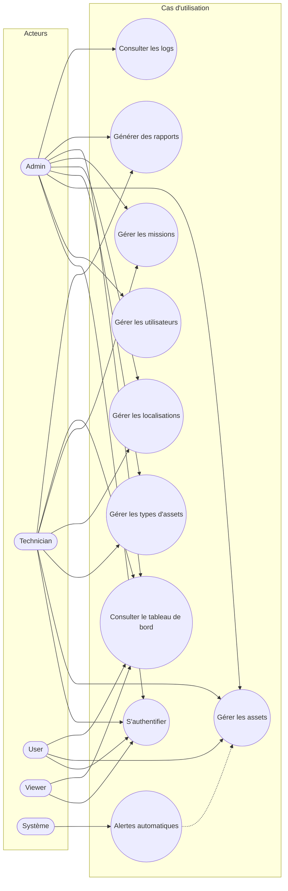

### 2.2 Cas d'utilisation détaillés

#### UC-01 : Authentification utilisateur

| Élément | Description |
|---------|-------------|
| **Acteur principal** | Utilisateur (tous rôles) |
| **Préconditions** | L'utilisateur dispose d'un compte actif |
| **Postconditions** | L'utilisateur est authentifié et accède au tableau de bord |

**Scénario nominal :**
1. L'utilisateur accède à la page de connexion (`/login`)
2. Le système affiche le formulaire d'authentification
3. L'utilisateur saisit son identifiant et mot de passe
4. Le système valide les credentials via Argon2
5. Le système crée un token JWT signé RS256
6. Le système redirige vers le tableau de bord approprié au rôle
7. Le système enregistre la connexion dans les logs

**Scénarios alternatifs :**
- Credentials invalides : afficher message d'erreur, incrémenter compteur échecs
- 5 échecs consécutifs : blocage temporaire (rate limiting)

#### UC-02 : Créer un asset

| Élément | Description |
|---------|-------------|
| **Acteur principal** | User (ou rôle supérieur) |
| **Préconditions** | L'utilisateur est authentifié avec droits d'écriture |
| **Postconditions** | L'asset est enregistré en base de données |

**Scénario nominal :**
1. L'utilisateur accède au module Assets (`/assets`)
2. L'utilisateur clique sur "Ajouter un asset"
3. Le système affiche le formulaire de création
4. L'utilisateur saisit : nom, type, statut, localisation, quantité
5. Le système valide les données et les contraintes d'intégrité
6. Le système enregistre l'asset avec horodatage
7. Le trigger automatique crée une entrée dans la table `log`
8. Le système affiche une confirmation

### 2.3 Diagramme de séquence - Authentification

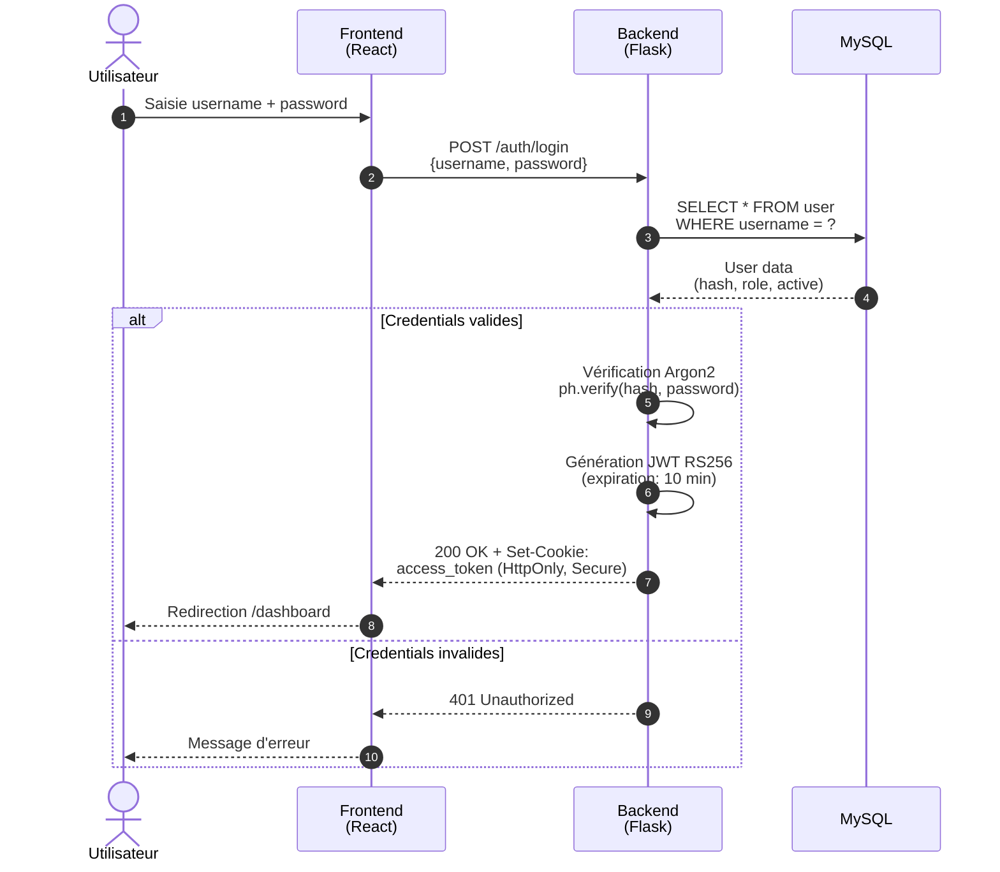

### 2.4 Diagramme de séquence - Création d'un asset

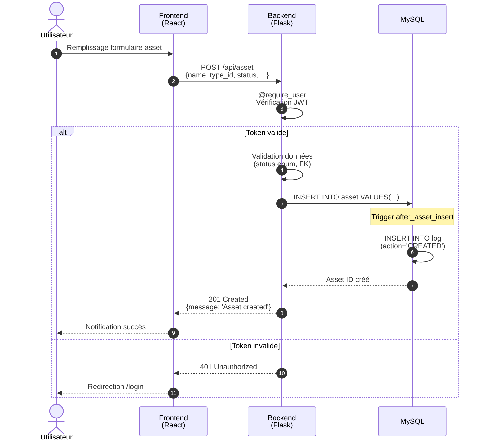

---

## 3. CONCEPTION DE LA BASE DE DONNÉES

### 3.1 Modèle Conceptuel de Données (MCD)

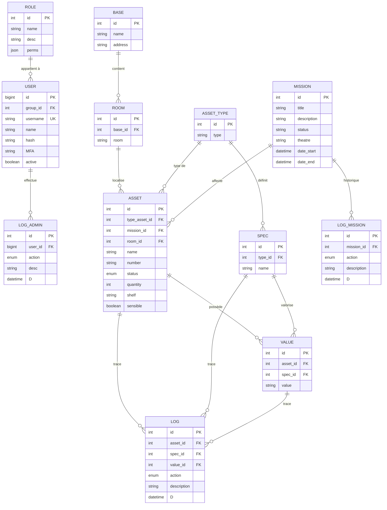

### 3.2 Modèle Logique de Données (MLD)

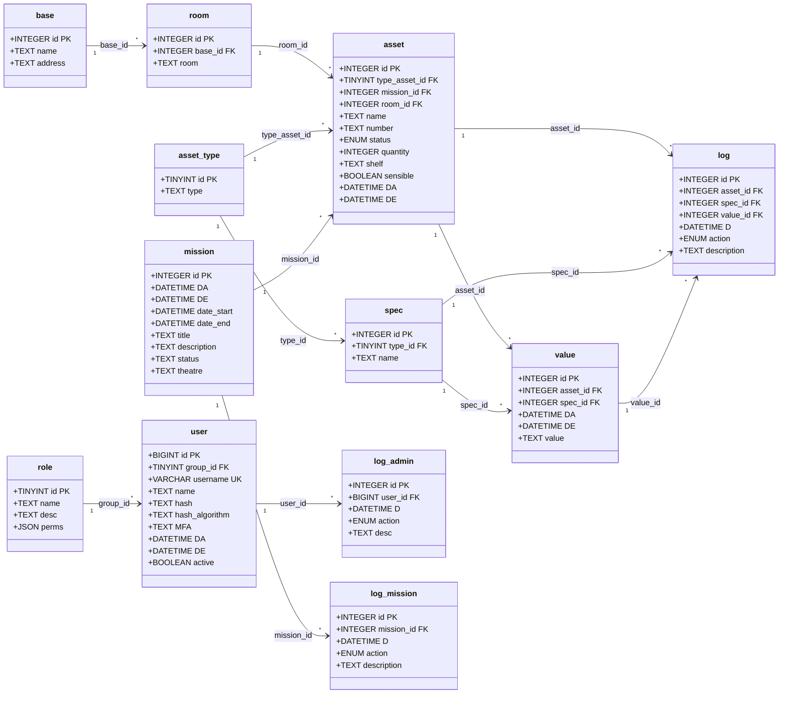

### 3.3 Dictionnaire de données

#### Table `user`

| Attribut | Type | Contraintes | Description |
|----------|------|-------------|-------------|
| id | BIGINT | PK, NOT NULL | Identifiant unique (UUID converti) |
| group_id | TINYINT | FK→role, NOT NULL | Rôle de l'utilisateur |
| username | VARCHAR(255) | UNIQUE, NOT NULL | Nom d'utilisateur unique |
| name | TEXT | NULL | Nom complet de l'utilisateur |
| hash | TEXT | NOT NULL | Hash du mot de passe (Argon2) |
| hash_algorithm | TEXT | NOT NULL | Algorithme utilisé (argon2) |
| MFA | TEXT | NULL | Seed TOTP pour 2FA |
| DA | DATETIME | NOT NULL | Date d'ajout |
| DE | DATETIME | NOT NULL | Date d'édition |
| active | BOOLEAN | NOT NULL, DEFAULT TRUE | Compte actif/inactif |

#### Table `asset`

| Attribut | Type | Contraintes | Description |
|----------|------|-------------|-------------|
| id | INTEGER | PK, AUTO_INCREMENT | Identifiant unique |
| type_asset_id | TINYINT UNSIGNED | FK→asset_type, NOT NULL | Type d'asset |
| mission_id | INTEGER | FK→mission, NULL | Mission assignée |
| room_id | INTEGER | FK→room, NULL | Localisation |
| name | TEXT | NOT NULL | Nom/Numéro de série |
| number | TEXT | NULL | Numéro secondaire |
| status | ENUM | NOT NULL | STOCK, DESTROYED, SOLD, LOST, TRANSIT, PURCHASED |
| quantity | INTEGER | NULL | Quantité (pour lots) |
| shelf | TEXT | NULL | Emplacement (étagère) |
| sensible | BOOLEAN | NULL | Matériel sensible |
| DA | DATETIME | NOT NULL | Date d'ajout |
| DE | DATETIME | NOT NULL | Date d'édition |

#### Table `role`

| Attribut | Type | Contraintes | Description |
|----------|------|-------------|-------------|
| id | TINYINT | PK, AUTO_INCREMENT | Identifiant unique |
| name | TEXT | NOT NULL | Nom du rôle (admin, user, viewer...) |
| desc | TEXT | NULL | Description du rôle |
| perms | JSON | NOT NULL | Permissions détaillées |

### 3.4 Triggers de la base de données

La base de données implémente des triggers pour l'audit automatique :

#### Trigger `after_asset_insert`

```sql
CREATE TRIGGER after_asset_insert
AFTER INSERT ON `asset`
FOR EACH ROW
BEGIN
    INSERT INTO `log` (`asset_id`, `D`, `action`, `description`)
    VALUES (
        NEW.id,
        NOW(),
        'CREATED',
        CONCAT('Asset created: ', NEW.name, ' (Type: ', NEW.type_asset_id, ', Status: ', NEW.status, ')')
    );
END
```

#### Trigger `after_asset_update`

Enregistre automatiquement toutes les modifications d'assets avec les anciennes et nouvelles valeurs.

---

## 4. ARCHITECTURE TECHNIQUE

### 4.1 Diagramme d'architecture globale

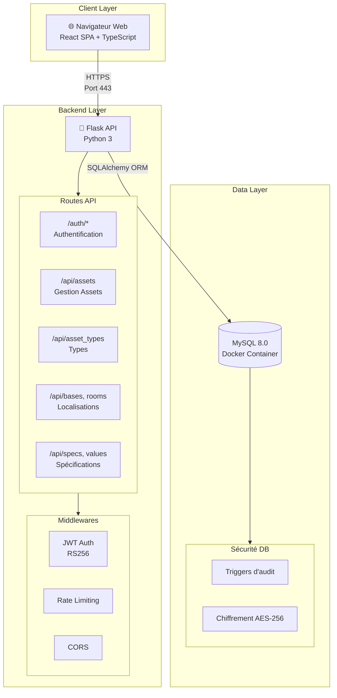

### 4.2 Stack technique

| Composant | Technologie | Version | Justification |
|-----------|-------------|---------|---------------|
| **Frontend** | React + TypeScript | 18+ | SPA moderne, typage fort |
| **Styling** | CSS personnalisé | - | Design système militaire |
| **Build Frontend** | Vite | 5+ | Build rapide, HMR |
| **Backend** | Flask (Python) | 3+ | API REST légère, flexible |
| **ORM** | SQLAlchemy | 2+ | Mapping objet-relationnel |
| **Base de données** | MySQL | 8.0+ | SGBD robuste, triggers natifs |
| **Authentification** | JWT RS256 | - | Tokens signés asymétriquement |
| **Hachage MDP** | Argon2 | - | Recommandé ANSSI |
| **Containerisation** | Docker | - | Portabilité, isolation |

### 4.3 Diagramme de composants

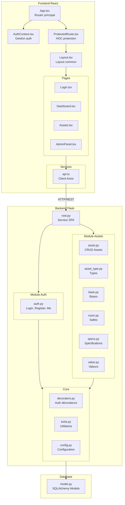

### 4.4 Structure des répertoires

```
P5-stock/
├── backend/
│   ├── database/
│   │   ├── __init__.py
│   │   ├── config.py          # Configuration DB
│   │   └── model.py           # Modèles SQLAlchemy
│   ├── src/
│   │   └── core/
│   │       ├── config.py      # Configuration Flask
│   │       ├── logs.py        # Configuration Loguru
│   │       ├── middleware.py  # Middlewares
│   │       ├── tools.py       # Utilitaires
│   │       ├── decorators/
│   │       │   └── decorators.py  # Décorateurs auth
│   │       └── routes/
│   │           ├── root.py    # Routes racine
│   │           ├── auth/
│   │           │   └── auth.py    # Authentification
│   │           └── assets/
│   │               ├── asset.py      # CRUD assets
│   │               ├── asset_type.py # Types
│   │               ├── base.py       # Bases
│   │               ├── room.py       # Salles
│   │               ├── specs.py      # Specs
│   │               └── value.py      # Valeurs
│   └── logs/                  # Fichiers de log
├── frontend/
│   ├── src/
│   │   ├── App.tsx            # Router principal
│   │   ├── main.tsx           # Point d'entrée
│   │   ├── components/
│   │   │   ├── Layout.tsx     # Layout commun
│   │   │   └── ProtectedRoute.tsx
│   │   ├── contexts/
│   │   │   └── AuthContext.tsx
│   │   ├── pages/
│   │   │   ├── Login.tsx
│   │   │   ├── Dashboard.tsx
│   │   │   ├── Assets.tsx
│   │   │   └── AdminPanel.tsx
│   │   ├── services/
│   │   │   └── api.ts         # Client API
│   │   └── styles/
│   │       └── globals.css
│   ├── vite.config.ts
│   └── tsconfig.json
├── database/
│   └── mysql-docker/
│       ├── docker-compose.yml
│       └── init.sql           # Script initialisation
└── documentation/
    ├── cahier charges.md
    └── database/
        ├── DB v1.5.json
        └── DB v1.5.sql
```

---

## 5. DÉVELOPPEMENT DE L'APPLICATION

### 5.1 API REST - Endpoints

#### Module Authentification (`/auth`)

| Méthode | Endpoint | Description | Autorisation |
|---------|----------|-------------|--------------|
| GET | `/auth/me` | Récupérer l'utilisateur courant | JWT valide |
| POST | `/auth/login` | Connexion utilisateur | Public (rate limited) |
| POST | `/auth/register` | Inscription utilisateur | Public |

#### Module Assets (`/api`)

| Méthode | Endpoint | Description | Autorisation |
|---------|----------|-------------|--------------|
| GET | `/api/assets` | Liste paginée des assets | Viewer+ |
| GET | `/api/assets/:id` | Détail d'un asset | Viewer+ |
| POST | `/api/asset` | Créer un asset | User+ |
| PUT | `/api/asset/:id` | Modifier un asset | User+ |
| DELETE | `/api/asset/:id` | Supprimer un asset | Technician+ |
| GET | `/api/asset_types` | Liste des types | Viewer+ |
| POST | `/api/asset_type` | Créer un type | Technician+ |
| GET | `/api/bases` | Liste des bases | Viewer+ |
| POST | `/api/base` | Créer une base | Technician+ |
| PUT | `/api/base/:id` | Modifier une base | Technician+ |
| GET | `/api/rooms` | Liste des salles | Viewer+ |
| POST | `/api/room` | Créer une salle | Technician+ |

### 5.2 Exemple de code - Création d'un asset

#### Backend (Flask - `asset.py`)

```python
@assets_blueprint.post("/asset")
@require_user
def insert_asset():
    try:
        data = request.json
        if data["status"] in ['STOCK', 'DESTROYED', 'SOLD', 'LOST', 'TRANSIT', 'PURCHASED']:
            asset = Asset(
                type_asset_id=data["asset_type_id"],
                room_id=data.get("room_id"),
                DA=datetime.utcnow(),
                DE=datetime.utcnow(),
                name=data["name"],
                number=data.get("number"),
                status=data["status"],
                quantity=data.get("quantity"),
                shelf=data.get("shelf"),
                sensible=data.get("sensible")
            )
        else:
            return jsonify({'error': 'Invalid status', 'status': 'error'}), 400
            
        db.session.add(asset)
        db.session.commit()
        logger.info(f"New asset by {request.current_user.id} : {asset.id}/{asset.name}")
        return jsonify({'message': 'Asset created', 'status': 'success'}), 201
    except KeyError as e:
        return jsonify({'error': 'Missing required fields', 'status': 'error'}), 400
```

#### Frontend (React - `api.ts`)

```typescript
export const assetsApi = {
  create: (data: {
    name: string
    asset_type_id: number
    status: string
    number?: string
    room_id?: number
    quantity?: number
    shelf?: string
    sensible?: boolean
  }) => api.post('/api/asset', data),
}
```

### 5.3 Système d'autorisation par décorateurs

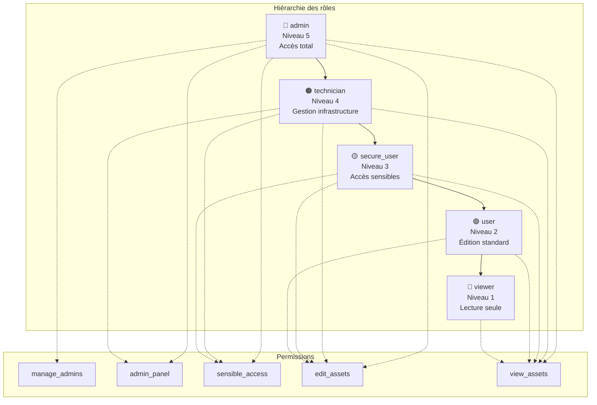

Les décorateurs Flask implémentent une chaîne de responsabilité :

```python
def require_user(f):
    @wraps(f)
    def decorated_function(*args, **kwargs):
        user = jwt_decode(request)
        if not user:
            return jsonify({'error': 'Invalid token'}), 401
        if user.role.name == 'user':
            return f(*args, **kwargs)
        return require_secure_user(f)(*args, **kwargs)
    return decorated_function
```

### 5.4 Interface utilisateur

#### Page Dashboard

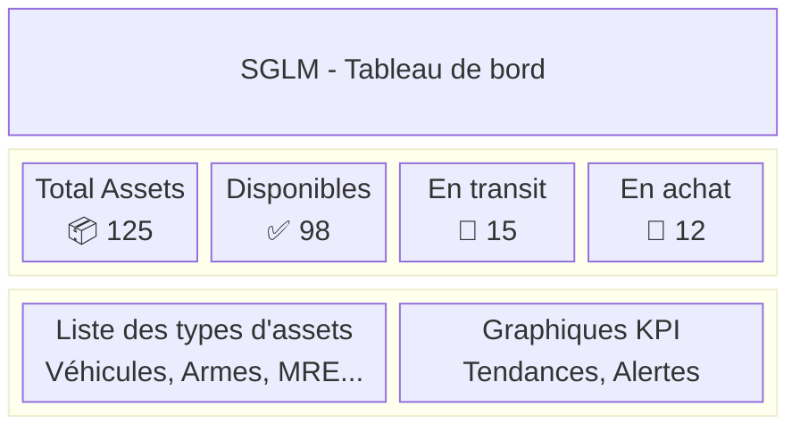

> **Éléments affichés :**
> - Total des assets enregistrés
> - Assets disponibles (statut STOCK)
> - Assets en transit
> - Assets en cours d'achat
> - Liste des types d'assets

#### Page Assets

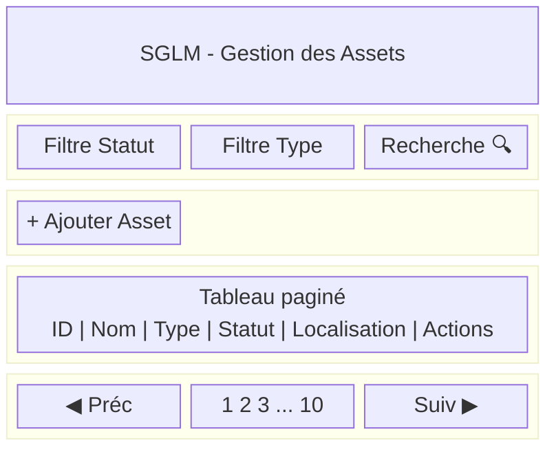

> **Fonctionnalités :**
> - Tableau paginé des assets
> - Filtres par statut, type, recherche
> - Modal de création/édition
> - Actions : éditer, supprimer

#### Page Login

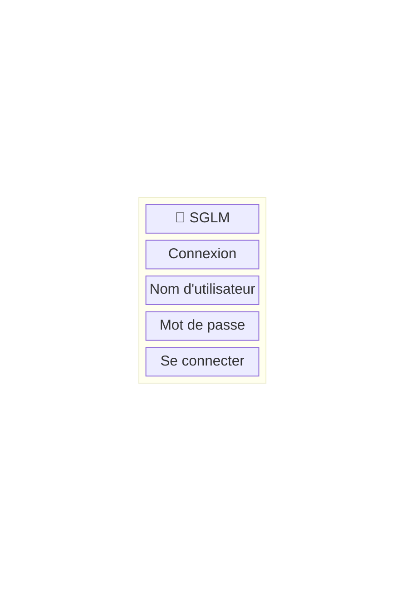

> **Éléments :**
> - Formulaire username/password
> - Bouton connexion
> - Messages d'erreur

---

## 6. SÉCURITÉ ET CONFORMITÉ

### 6.1 Conformité ANSSI

Le système respecte les recommandations de l'ANSSI pour les applications web :

| Exigence | Implémentation | Statut |
|----------|----------------|--------|
| **ES-101** Hachage robuste | Argon2 (argon2-cffi) | ✅ |
| **ES-103** MFA | Préparé (champ MFA en base) | 🔄 |
| **ES-104** Anti-brute force | Rate limiting (5 req/min login) | ✅ |
| **ES-105** JWT signé | RS256 avec clés RSA | ✅ |
| **ES-201** RBAC | 5 niveaux de rôles | ✅ |
| **ES-401** Anti-injection SQL | SQLAlchemy ORM (paramétré) | ✅ |
| **ES-403** Anti-CSRF | Cookie SameSite=Strict | ✅ |
| **ES-405** Headers sécurité | HttpOnly, Secure cookies | ✅ |

### 6.2 Authentification JWT RS256

```python
# Génération du token (auth.py)
access_payload = {
    'user_id': user.id,
    'exp': datetime.utcnow() + timedelta(minutes=10),
    'iat': datetime.utcnow(),
    'type': 'access'
}
private_key = open('private.pem', 'rb').read()
access_token = jwt.encode(access_payload, private_key, algorithm='RS256')

# Cookie sécurisé
response.set_cookie(
    'access_token',
    access_token,
    httponly=True,   # Prévention XSS
    secure=True,     # HTTPS uniquement
    samesite='Strict', # Prévention CSRF
    max_age=10 * 60  # 10 minutes
)
```

### 6.3 Protection des mots de passe

```python
from argon2 import PasswordHasher

ph = PasswordHasher()

# Hachage à l'inscription
user.hash = ph.hash(password)

# Vérification à la connexion
def verify_password(plain: str, hashed: str) -> bool:
    try:
        ph.verify(hashed, plain)
        return True
    except VerifyMismatchError:
        return False
```

### 6.4 Validation des entrées

```python
def validate_username(username):
    if len(username) < 2 or len(username) > 35:
        return False
    forbidden_words = ['admin', 'root', 'system', 'null', 'undefined', 'select', 'drop', 'insert']
    if username.lower() in forbidden_words:
        return False
    if not re.match(r'^[a-zA-Z0-9_-]+$', username):
        return False
    return True
```

### 6.5 Audit et traçabilité

Toutes les actions sont automatiquement enregistrées via les triggers MySQL :

- **Table `log`** : Actions sur les assets (création, modification, suppression)
- **Table `log_admin`** : Actions administratives sur les utilisateurs
- **Table `log_mission`** : Actions sur les missions

---

## 7. TESTS ET VALIDATION

### 7.1 Plan de tests

| Type de test | Outil | Couverture cible |
|--------------|-------|------------------|
| Tests unitaires Backend | pytest | 80% |
| Tests unitaires Frontend | Vitest | 70% |
| Tests d'intégration API | pytest + requests | Endpoints critiques |
| Tests E2E | Playwright | Parcours utilisateur |
| Tests de sécurité | OWASP ZAP | Vulnérabilités OWASP |
| Tests de charge | k6 | 200 utilisateurs simultanés |

### 7.2 Cas de tests fonctionnels

#### CT-01 : Connexion utilisateur valide

| Étape | Action | Résultat attendu |
|-------|--------|------------------|
| 1 | Accéder à /login | Formulaire affiché |
| 2 | Saisir username valide | Champ accepté |
| 3 | Saisir password valide | Champ accepté |
| 4 | Cliquer "Se connecter" | Redirection vers /dashboard |
| 5 | Vérifier cookie | access_token présent |

#### CT-02 : Connexion avec mauvais mot de passe

| Étape | Action | Résultat attendu |
|-------|--------|------------------|
| 1 | Saisir username valide | Champ accepté |
| 2 | Saisir password invalide | Champ accepté |
| 3 | Cliquer "Se connecter" | Message "Username or password incorrect" |
| 4 | Vérifier cookie | Aucun token |

#### CT-03 : Création d'un asset

| Étape | Action | Résultat attendu |
|-------|--------|------------------|
| 1 | Accéder à /assets | Liste des assets affichée |
| 2 | Cliquer "Ajouter" | Modal création ouvert |
| 3 | Remplir champs obligatoires | Validation OK |
| 4 | Cliquer "Créer" | Asset ajouté à la liste |
| 5 | Vérifier en base | Enregistrement créé + log |

### 7.3 Matrice de traçabilité

| Exigence | Cas de test | Statut |
|----------|-------------|--------|
| EF-101 | CT-01, CT-02 | ✅ |
| EF-103 | CT-RBAC-01 | ✅ |
| EF-201 | CT-03 | ✅ |
| EF-401 | CT-LOG-01 | ✅ |
| ES-101 | CT-HASH-01 | ✅ |
| ES-104 | CT-RATE-01 | ✅ |

---

## 8. CONCLUSION ET PERSPECTIVES

### 8.1 Bilan du projet

Le projet SGLM a permis de développer une application web complète de gestion logistique militaire répondant aux exigences du cahier des charges :

**Réalisations :**
- ✅ Architecture moderne Frontend/Backend découplée
- ✅ API REST sécurisée avec authentification JWT RS256
- ✅ Base de données MySQL avec audit automatique
- ✅ Système de rôles RBAC à 5 niveaux
- ✅ Interface utilisateur responsive
- ✅ Conformité partielle ANSSI

### 8.2 Difficultés rencontrées

1. **Gestion des sessions JWT** : Choix entre cookies HttpOnly et localStorage
2. **Hiérarchie des rôles** : Implémentation de la chaîne de décorateurs
3. **Triggers MySQL** : Débogage des triggers d'audit automatique

### 8.3 Perspectives d'évolution

| Priorité | Fonctionnalité | Description |
|----------|----------------|-------------|
| P1 | MFA TOTP | Implémentation de l'authentification à deux facteurs |
| P1 | Module Missions | CRUD complet des missions avec affectation d'assets |
| P2 | Tableau de bord avancé | Graphiques, KPI temps réel, alertes |
| P2 | Export rapports | PDF et CSV des données |
| P3 | Mode hors ligne | PWA avec synchronisation |
| P3 | Application mobile | Version React Native |

### 8.4 Compétences acquises

- Développement fullstack (React + Flask)
- Conception de bases de données relationnelles
- Sécurité applicative (OWASP, ANSSI)
- Authentification JWT et gestion des sessions
- Containerisation Docker
- Méthodologie de projet (Kanban)

---

## 9. ANNEXES

### Annexe A : Schéma de la base de données

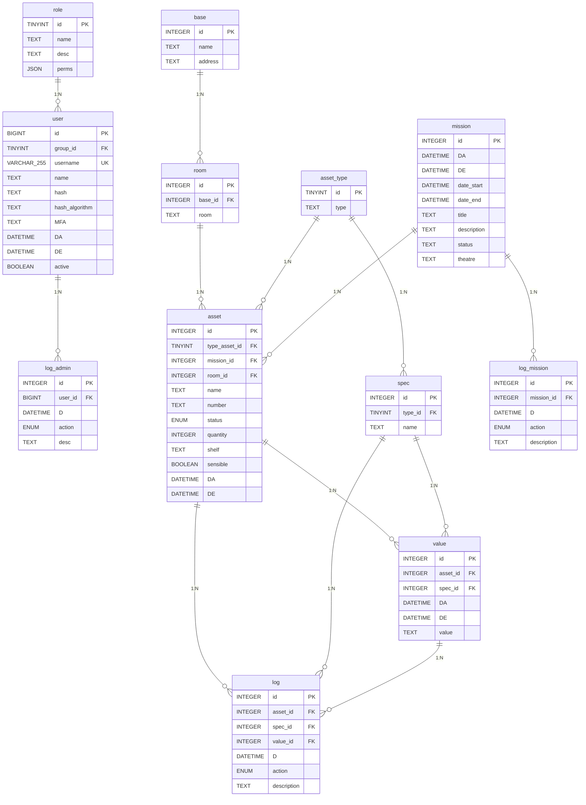

### Annexe B : Documentation API (Swagger/OpenAPI)

> **Note** : La documentation complète de l'API est disponible via Swagger UI à l'adresse `/api/docs` une fois l'application démarrée.

### Annexe C : Captures d'écran de l'application

> **Note** : Les captures d'écran réelles doivent être insérées ici après déploiement de l'application.
> - Page de connexion
> - Tableau de bord
> - Liste des assets
> - Modal création asset
> - Panel administration

### Annexe D : Diagramme de Gantt du projet

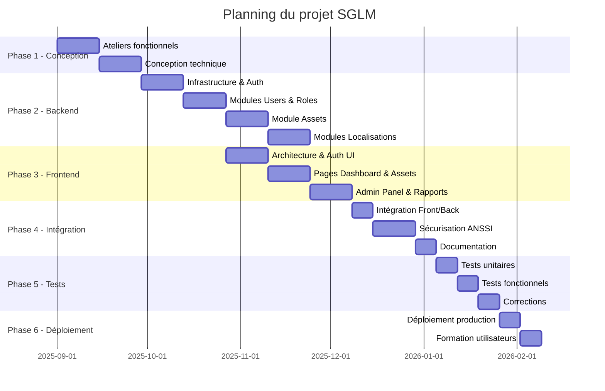

### Annexe E : Glossaire

| Terme | Définition |
|-------|------------|
| **Asset** | Équipement ou matériel géré par le système |
| **RBAC** | Role-Based Access Control - Contrôle d'accès basé sur les rôles |
| **JWT** | JSON Web Token - Standard de token d'authentification |
| **ANSSI** | Agence Nationale de la Sécurité des Systèmes d'Information |
| **MFA** | Multi-Factor Authentication - Authentification multi-facteurs |
| **ORM** | Object-Relational Mapping - Mapping objet-relationnel |
| **SPA** | Single Page Application - Application monopage |
| **API REST** | Interface de programmation suivant les principes REST |

---

**Document rédigé le** : Janvier 2026

**Version** : 1.0
